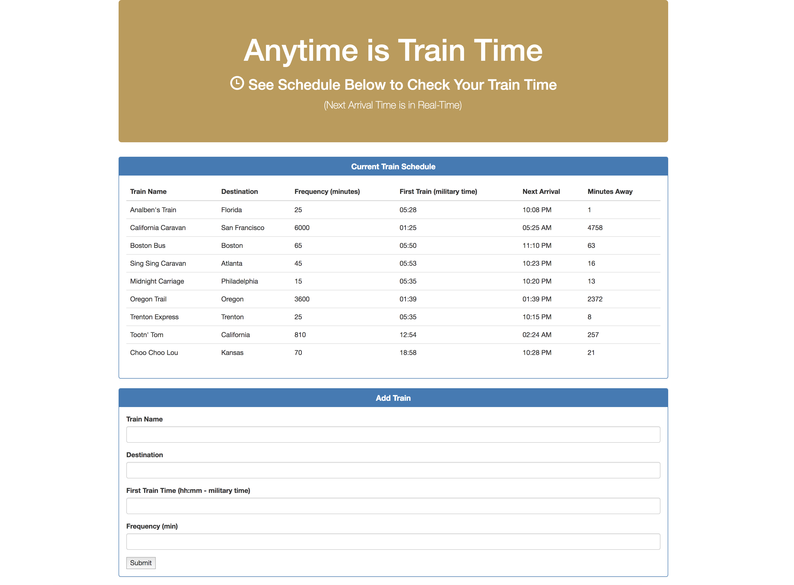

# Train Schedule Application

Click Here to Visit: [https://juliajyshin.github.io/Train-Scheduler-Firebase/](https://juliajyshin.github.io/Train-Scheduler-Firebase/)

## Project Description

This is a train schedule application that incorporates Firebase to host arrival and departure data. The app retrieves and manipulates information with Moment.js. This website will provide up-to-date information about various trains, namely their arrival times and how many minutes remain until they arrive at their station. Use this app to calculate when the next train will arrive; this should be relative to the current time. It uses Firebase to store it's data, GitHub to backup the project and GitHub Pages to host the finished site.
  
* Users from many different machines are able to view same train times.

## Technologies

* HTML
* CSS
* jQuery
* JavaScript
* Firebase
* Moment.js

## Author
* https://github.com/juliajyshin
* [Buy me a coffee ☕️](https://ko-fi.com/juliajverie)
